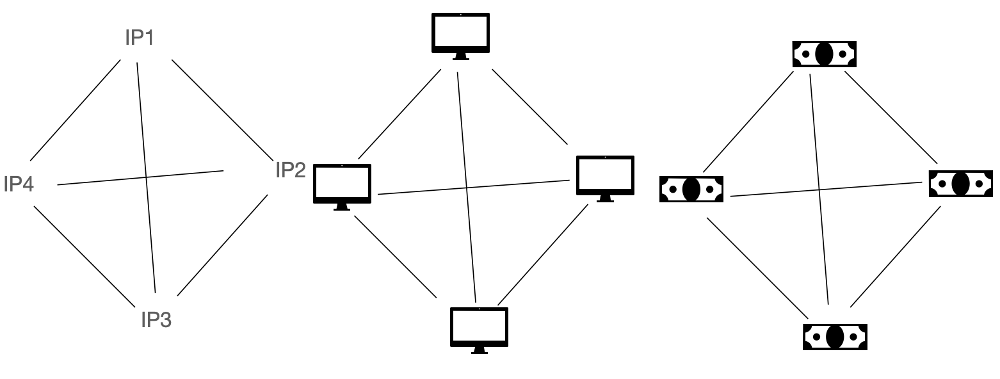
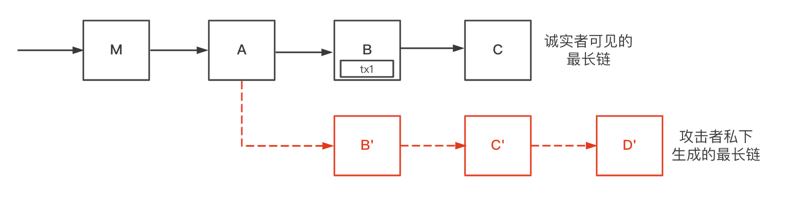
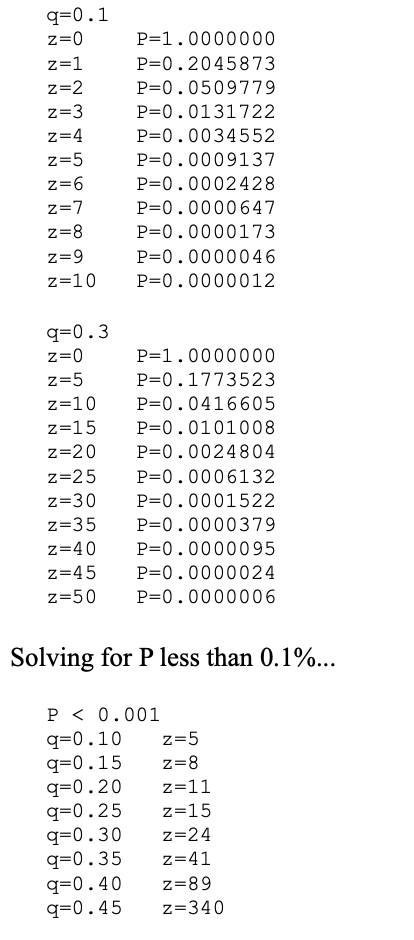
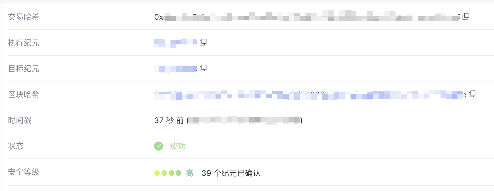
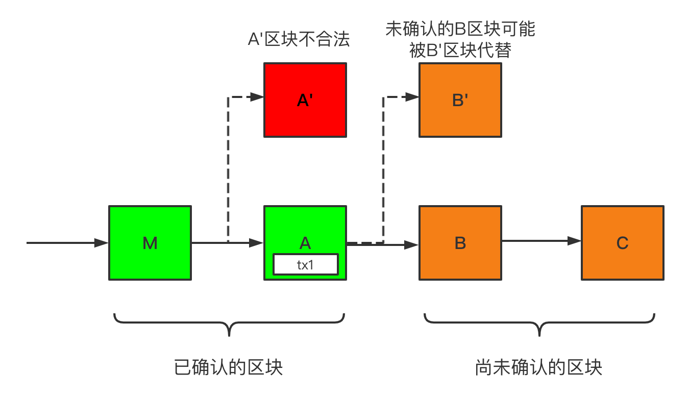
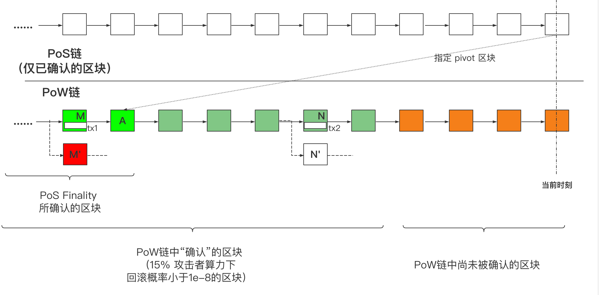

# Conflux 的 PoS Finality 与解读

> 本文仅代表本人的看法与理解，诸多观点可能存在可讨论之处，如有错误也欢迎各位留言指正。

Conflux 计划于主网中引入名为 PoS Finality 的机制，本文将就此机制尝试进行解读。本文将主要围绕 PoS Finality 这个概念进行解释，具体而言，就是分别解释清楚

1. 何为`PoS`
2. 何为`Finality`
3. 何为`PoS Finality`

这三个问题。

## 何为 PoS

> 这一部分大体可看作是 [Conflux杨光：PoW和PoS的全面比较](https://zhuanlan.zhihu.com/p/60702898) 内容的一个子集，原文基本把我能想到的东西都说清楚了，不过因此原文篇幅也偏长。熟悉这一概念的读者可以跳过这一部分。

我们不妨先来回顾一下区块链的核心功能：从一个高层次的角度来看，所有的区块链都可以认为是一个去中心化的账本。“去中心化”意味着这个系统的状态由诸多参与者一同决定，并且能在一部分恶意参与者进行破坏的情况下正常工作；“账本”意味着在所有人眼中，区块链中的交易会有一致的顺序（这个性质也叫全序性）。而如何去中心化地维护交易的全序性，就是由区块链中的共识所负责的。

当区块链中的节点身份已知的情况下，可以基于“投票”这一直观的手段构造共识维护账本。这种情况下只要**恶意节点的数目**小于某个阈值（如 1/3），区块链网络就能安全地运行。而问题在于如何在节点身份未知的互联网环境中维护账本。这时简单地基于节点数进行投票是行不通的，一个恶意的节点可以很容易地实施“女巫攻击”，即控制若干 IP 地址，从而伪造出若干虚假的身份进而突破区块链的安全阈值。一旦安全阈值被突破，区块链的安全性质将无法被保证。而比特币的一个核心贡献就是使用基于“工作量证明”（`PoW, Proof of Work`）的共识。在比特币网络中，一个节点投入的**算力**越多，它拥有的投票权越大（比特币中就是越有可能成功打包区块，获得记账权）。这让恶意节点的攻击变得困难。

PoW 所做的事是将难以轻易获取的“算力”映射为了系统中的投票权，从而防止了女巫攻击。而“权益证明”（`PoS, Proof of Stake`）也是顺着这一思路而被提出的。Stake 指的是系统中的代币（如以太坊中的 Ether），与 PoW 相似，在 PoS 下，一个节点所质押的代币数（而非投入的算力）越多，它的投票权越大。PoS 类共识中，安全阈值变为了**Stake比例**。

此外 PoS 还隐含着这样的逻辑：大量持币的用户与整条区块链的利害大体是一致的，他们会更倾向于不对区块链发起攻击。否则一旦区块链的安全性出现问题，将直接引起币价下跌，持有大量代币的用户会遭受到更大的损失。

传统BFT, PoW, PoS 的示意图

各类基于 PoS 的共识可能会有比较大的差别，这里不作过多讨论。但一般地，基于 PoS 的协议回避了 PoW 中“挖矿”时需要消耗大量能源的问题，同时也能达成更高的 TPS 并拥有更低的延迟。但 PoS 各类协议中，记账的矿工往往在记账前就已经被决定了，这一性质也带来了诸多 PoW 中没有的攻击，使得 PoS 的协议更为复杂与脆弱，不少攻击也难以被完全杜绝。

<!-- 这段说的不太行 先注释掉 除此之外，就我个人的角度而言，在公有链系统中，PoS中还存在着一个非常大的问题：如果整个区块链完全由PoS进行驱动，公有链“自由加入”这一性质便打了折扣。如果一个全新的节点想要参与共识，它必须要想办法从其他矿工手中获取 Stake，如果其他矿工不愿意出售，那么新的节点将永远无法加入系统。而在PoW类共识中，只要节点能够提供算力（虽然ASIC矿机与通用计算机的效率存在很大差别），它都能随时加入系统。 -->

## 何为 Finality

Finality，常译作“最终性”或“最终确定性”。[币安的词汇表](https://academy.binance.com/zh/glossary/finality)中是这么解释的：

> Finality is the assurance or guarantee that cryptocurrency transactions cannot be altered, reversed, or canceled after they are completed.

可大致意译为：最终性是交易完成（上链）后无法被更改、回滚或取消的保证。

在比特币等大部分使用 PoW 的链（也包括 Conflux）中**不存在最终性**，或者说，**最终性是概率达成的**。因为矿工们会根据**最长链原则**跟随最长链进行挖矿，已上链的交易总有被回滚的可能。下图是一个交易被回滚的典型情况。

D'所在链会成为最长链，tx1会被回滚

区块`B`中存在着已上链的交易`tx1`，此时诚实者可见的最新区块为区块`C`。但如果攻击者私下里成功生成了一条更长的链（最新区块为`D'`），并将这条链公开，诚实的矿工会根据最长链原则在`D'`块的基础上进行挖矿，`B`区块（包括`tx1`）会随之被回滚。而由于 PoW 中区块是被概率挖出的，即使这个攻击者拥有的算力不高（如10%甚至更低），但只要他足够“幸运”，这种攻击就能成功。

不过不难想象，如果`tx1`位于的区块更深，比如位于区块`M`中，攻击者就必须要从比`M`更早的区块中延伸出一条新的链，这种攻击成功的概率也就越小。一笔交易上链的时间越长，所位于的区块越“深”，被回滚也就可能性就越低。交易总有可能被回滚，但在实际的使用中，但只要这种可能性低到一定程度，我们就会认为一笔交易已经被“确认”了。

在比特币白皮书中基于非常朴素的假设对回滚的概率作出了计算，如下图。

比特币白皮书对区块回滚概率的计算

其中 `q` 表示攻击者持有的算力比例，`z`表示回滚的区块数目，`P`表示攻击者区块被回滚的概率。可以看到，攻击者持有的算力比例越高，回滚就越有可能发生。通常认为，比特币中确认时间为6个区块，约一个小时。可以看到，攻击者算力比例为10%的情况下，发生回滚的概率是小于0.1%的。ConfluxScan 上，一笔交易显示安全等级为高则代表着，攻击者算力比例为15%的情况下，交易发生回滚的概率小于`1e-8`（0.000001%），这时Conflux提供的SDK都会认为该交易已被确认。

ConfluxScan 中显示的交易状态

而相应的，具有 Finality 的共识，如传统的基于投票机制的 BFT 共识与部分 PoS 类共识，一旦某个区块根据明确的规则得到了”确认“（或者说已提交，`commited`），只要安全假设成立，已确认的交易将不会被回滚。确认的规则则因协议而异。

以下图举例，在某条假想的**具有最终性**的 PoS 链上，`M`、`A`区块已被确认，`B`、`C`区块尚未被确认。图中的`A'`区块将不可能被合法地生成，包含交易的`tx1`的A区块也不会被回滚，而`B`、`C`区块尚未被确认，仍有发生回滚的可能。

当区块链的安全假设被突破时（如攻击者拥有超过 2/3 的 Stake），`A'`区块是可以被生成的，但同时一个诚实的节点/矿工是能够根据明确的规则判断出A区块与A'区块冲突，当前的情况并不合法，他可以根据规则拒绝`A'`块。但在 PoW 链中并不存在明确的确认规则，也不存在一个对应的明确的算法。

具备最终性的区块链中，已确认的交易不会被回滚

## 何为 PoS Finality

那么何为 PoS Finality？可以先来参考[论坛](https://forum.conflux.fun/t/conflux-pos-finality/9919)中的解释。

> 在一个 PoW 链生态的早期，在全网算力较低的时候，可能会出现 51% 攻击的问题。特别是公有链的发展催生了一些算力租借平台的时候。在去年，以太经典、Grin 和 Verge 都曾出现了 51% 攻击的问题。

> 为了应对 51% 攻击可能带来的威胁，Conflux 将引入一条独立运行的 PoS 链。PoS 链的共识参与者将定期对树图结构 pivot 区块签名。拥有足够多签名的 pivot 区块应当被所有 PoW 矿工选进 pivot 链，哪怕它的兄弟区块权重更大。简单来说，PoS 链指定了一个 pivot 区块，所有的 PoW 矿工都应该跟随。

> 这意味着，一旦 PoS 共识对一个 pivot 区块投票，即使 51% 攻击者尝试逆转这个区块，也不会被 PoW 节点认可。

> Conflux 要求 PoS 共识克制地使用“指定 pivot 区块”的权力。**一个区块首先要根据 PoW 的规则确认满几分钟，诚实的 PoS 节点才会对它进行签名。这意味着，树图结构的区块排序和确认依然由 PoW 的矿工完成。**

在 Finality 部分已经提到，PoW 链中矿工往往会跟随“最长链”进行挖矿（Conflux使用的`GHAST`算法更复杂一些），因此如果攻击者能够自行制造一条最长链，就能任意地逆转已上链的交易。

对此 Conflux 给出的解决办法就是引入一条**具备最终性的 PoS 链**，由 PoS 链不断投票在 PoW 链上指定 pivot 区块（可以理解为设置 checkpoint），从而使得攻击者（尤其是51%攻击者）无法大规模地逆转区块。而这一段最核心的内容在我看来是最后一句，表明PoS链的能力与作用：

**一个区块首先要根据 PoW 的规则确认满几分钟，诚实的 PoS 节点才会对它进行签名。这意味着，树图结构的区块排序和确认依然由 PoW 的矿工完成。**

在这样的机制下，确认机制如下图：
> 图中进行了部分简化处理，PoW链并非单链结构，PoS与PoW链的出块频率也并不一致

PoS Finality 能够真正给予 PoW 链 Finality

图中 PoW 链中橙色区块代表回滚概率大于`1e-8`的尚未被确认区块，橙色区块左侧的绿色区块代表回滚概率低于`1e-8`的“已确认”区块。而 PoS Finality 引入的变化在于最左侧亮绿色的区块（`M`、`A`以及更左侧的未画出的区块）。在当前时刻，PoS 链上已确认的最新区块将 PoW 链中确认足够久的A区块指定为了“检查点”，为 PoW 链提供了一个明确的确认规则，这意味着亮绿色部分的区块将不会被回滚。

此时在 PoW 链中，一个拥有51%以上的算力的攻击者，是有能力从`N`区块前”分岔“出区块`N'`，并使得`N'`区块成为 pivot 区块的。一旦对应情况发生，遵守`GHAST`规则的矿工会跟随这次攻击，基于新的树图结构进行挖矿，这也意味着`N`区块中的交易`tx2`被回滚。

在 PoS Finality 引入之前，这种情况也会发生在区块M身上。但在引入 PoS Finality 之后，诚实的矿工会优先认可 PoS 链指定的“检查点”区块`A`，`M'`区块不会被诚实矿工认可为 pivot 区块，`M`中的`tx1`也不会被回滚。

PoS Finality 机制的主要功能就是应对 PoW 链中的 51% 算力攻击，而如帖子中所述，去年在ETC、Grin 和 Verge等公链中都发生过51%攻击。如果将来 Conflux 中有大量恶意算力涌入，用户可以借助 PoS 链带来的 Finality 对交易进行确认，这时确认耗时会增加，但即使 51% 攻击发生，亮绿色区块中的交易（如图中的`tx1`）也不会被回滚。而重要性较低的小额交易可以仍然基于原有规则进行确认，与未引入 PoS Finality 时无异。

## 小结

本文简单介绍了 PoS Finality 这个概念本身。PoS 机制的一大优势就是 PoS 网络的维护者会更倾向于维护网络安全运行而非进行攻击。Conflux 接下来要引入的 PoS 链 并不是要替代原有的基于 PoW 的树图共识，而是借助 PoS 链所具有的最终性，“克制地”为PoW链提供最终性，并借此抵抗将来可能会发生的51%攻击。
