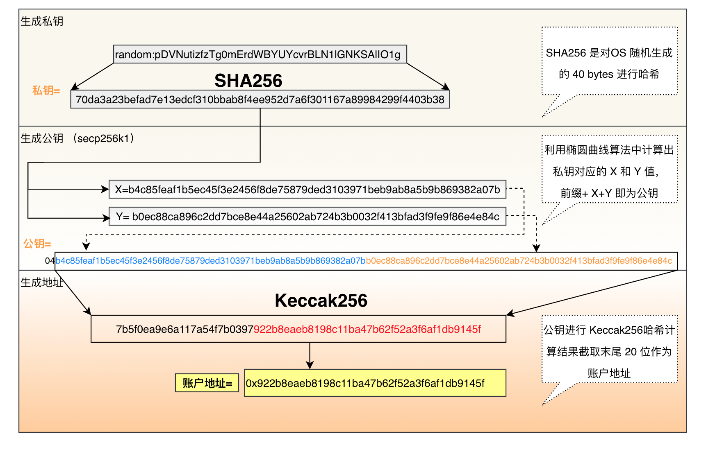
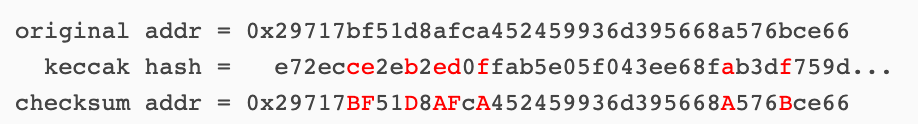
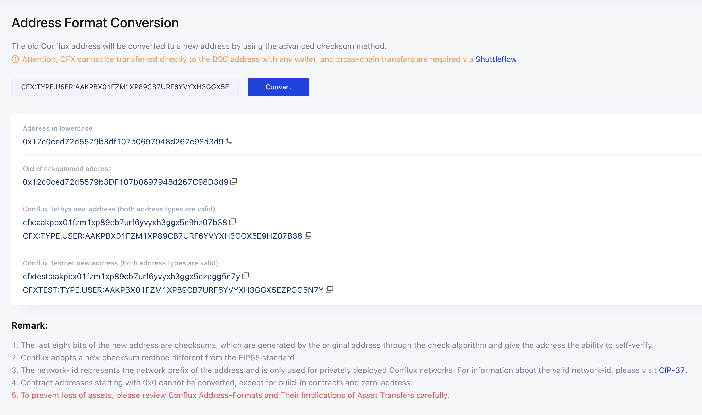
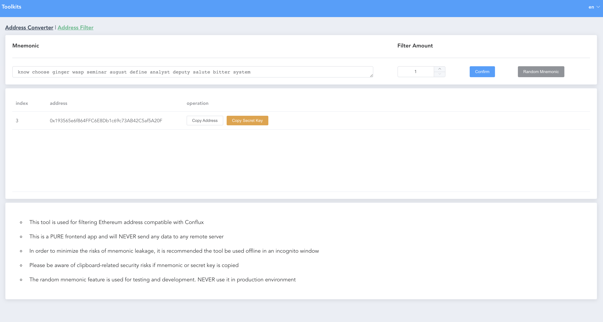

# Conflux 网络地址介绍

Conflux 最初使用同以太坊一样的 `hex40` 格式地址，但对地址首位做了限制，只有 `0x0`, `0x1`, `0x8` 三种前缀的地址是合法的，并且这三种前缀可用于区分地址的类型：

* `0x0` 内置合约地址
* `0x1` 普通外部账户地址
* `0x8` 合约地址

但由于地址格式类似，又不能完全互相使用(因为Conflux限制了固定的前缀)，导致极易与以太坊地址混用，进而导致资产丢失。为了解决此问题，Conflux 通过[CIP-37](https://github.com/Conflux-Chain/CIPs/blob/master/CIPs/cip-37.md) 引入了新的 Base32 格式的地址。
本文将对 Conflux 地址做一个详细介绍。

## 以太坊 hex40 地址

以太坊账户私钥是一个 256 位的字符串(32 字节)，通常是随机生成。

```
18e14a7b6a307f426a94f8114701e7c8e774e7f9a47e2c2035db29a206321725
```

然后通过椭圆曲线算法计算得到私钥对应的 X 和 Y 值。`04` + X + Y 即为公钥(65字节)

```
04
50863ad64a87ae8a2fe83c1af1a8403cb53f53e486d8511dad8a04887e5b2352
2cd470243453a299fa9e77237716103abc11a1df38855ed6f2ee187e9c582ba6
```

最后对公钥(`不包含`04前缀)进行 Keccak-256 计算得到哈希值，取最后 20 字节作为以太坊地址

```
1016f75c54c607f082ae6b0881fac0abeda21781
```

即 0x1016f75c54c607f082ae6b0881fac0abeda21781



并且以太坊通过[EIP-55](https://eips.ethereum.org/EIPS/eip-55)引入了一个带校验的地址格式，它的实现非常简单，即对地址做一个keccak256哈希，然后按位对齐，将`哈希值>=8`的字母变成大写：



**需要注意的是在 Solidity 智能合约中，要求必须使用 checkSum 格式地址**

## Conflux Base32 地址

Conflux 的地址生成规则同以太坊一样，只是地址生成后强制将地址首位换成了 `0x1`

* 0x`7`defad05b632ba2cef7ea20731021657e20a7596
* 0x`1`defad05b632ba2cef7ea20731021657e20a7596

然后对 0x1 开头的地址进行 base32 编码，得到 Conflux 目前使用的 base32 格式地址:

```cfx:aarc9abycue0hhzgyrr53m6cxedgccrmmyybjgh4xg```

两种格式的地址只是编码方式不同，但所表达的信息相同，可以`互相转换`

### 具体编码规则

编码使用32个字符：`abcdefghjkmnprstuvwxyz0123456789 (i, l, o, q removed)`

#### 网络前缀

根据 networkId 确定网络前缀：

* 1: `cfxtest`
* 1029: `cfx`
* N: `netN`

#### payload

使用固定的 `0` 作为 version byte, 然后加上 hex40 地址的 byte 数据，构造为 `payload`，然后对 payload 进行 base32 编码。

#### checksum

构造计算 checksum 的 data：

* 网络前缀每个字符的低 5 位. "cfx..." 对应 0x03, 0x06, 0x18, ...
* 一个 0 (5 个 0 bit) 作为连接符
* payload
* 8 个 0 (作为 checksum 的 template)

使用如下方法计算得到一个 40 bit 的数字，转换为 8 个 base32 字符作为 checksum

```c++
uint64_t PolyMod(const data &v) {
    uint64_t c = 1;
    for (uint8_t d : v) {
        uint8_t c0 = c >> 35;
        c = ((c & 0x07ffffffff) << 5) ^ d;

        if (c0 & 0x01) c ^= 0x98f2bc8e61;
        if (c0 & 0x02) c ^= 0x79b76d99e2;
        if (c0 & 0x04) c ^= 0xf33e5fb3c4;
        if (c0 & 0x08) c ^= 0xae2eabe2a8;
        if (c0 & 0x10) c ^= 0x1e4f43e470;
    }
    return c ^ 1;
}
```

最终将所有数据连接到一起:

netprefix + ":" + payload + checksum

#### 可选的地址类型信息

base32 地址中可以包含一个可选的地址类型信息, 该信息不参与 checksum 计算，地址类型有如下四种:

* `type.contract` 普通合约
* `type.user` 普通用户
* `type.builtin` - 内置合约
* `type.null` 零地址类型

通常带类型信息的地址使用大写字母表示

```
CFX:TYPE.USER:AAKPBX01FZM1XP89CB7URF6YVYXH3GGX5E9HZ07B38
```

具体的地址规范参看 [CIP-37规范](https://github.com/Conflux-Chain/CIPs/blob/master/CIPs/cip-37.md)

## Base32 使用场景

`Conflux-rust` 从 `v1.1.1` 开始所有涉及到地址的 RPC 方法均只接受 base32 格式地址，Portal 也同步进行了升级默认显示和接受新格式的地址。主要场景均需使用新地址:

* RPC 交互
* 钱包转账
* 使用 SDK 开发应用

目前`只有一种场景`需要使用 hex40 checksum 格式地址，即是在开发 Solidity 智能合约时，在 **Solidity 代码**中只能使用 hex40 checksum 地址（受 Solidity 编译器限制)

另外在跟合约方法进行交互时，涉及到传参或返回结果的地方，本质也要求使用 ABI 编码的 hex40 地址。但使用 Conflux 的 SDK 进行交互时，SDK 会自动进行地址格式转换，因此可以说此种场景也是使用 base32 格式地址。

## SDK address 方法 和 Scan 地址转换工具

Conflux 各语言 SDK 均提供了两种格式地址的转换方法。官方开发的 JS, Go, Java, Python 语言 SDK，以及社区开发的 C++ SDK 等。
以 js-sdk 为例:

```js
const {format} = require('js-conflux-sdk');

const hexAddress = "0x12c0ced72d5579b3df107b0697948d267c98d3d9";
const base32Address = "cfx:aakpbx01fzm1xp89cb7urf6yvyxh3ggx5e9hz07b38";
const netId = 1029;

// hex to base32
format.address(hexAddress, netId);
// cfx:aakpbx01fzm1xp89cb7urf6yvyxh3ggx5e9hz07b38
format.hexAddress(base32Address);
// 0x12c0ced72d5579b3df107b0697948d267c98d3d9
```

另外 JS-SDK 还提供了多个地址相关的 utilities 方法

```js
const {address} = require('js-conflux-sdk');
/*
{
  encodeCfxAddress: [Function: encode],
  decodeCfxAddress: [Function: decode],
  ethChecksumAddress: [Function: ethChecksumAddress],
  ethAddressToCfxAddress: [Function: ethAddressToCfxAddress],
  ADDRESS_TYPES: {
    USER: 'user',
    CONTRACT: 'contract',
    BUILTIN: 'builtin',
    NULL: 'null'
  },
  isValidCfxAddress: [Function: isValidCfxAddress],
  verifyCfxAddress: [Function: verifyCfxAddress],
  hasNetworkPrefix: [Function: hasNetworkPrefix],
  simplifyCfxAddress: [Function: simplifyCfxAddress],
  shortenCfxAddress: [Function: shortenCfxAddress],
  isZeroAddress: [Function: isZeroAddress],
  isInternalContractAddress: [Function: isInternalContractAddress],
  isValidHexAddress: [Function: isValidHexAddress],
  isValidCfxHexAddress: [Function: isValidCfxHexAddress]
}
*/

address.encodeCfxAddress(hexAddress, netId, true);
// CFX:TYPE.USER:AAKPBX01FZM1XP89CB7URF6YVYXH3GGX5E9HZ07B38
address.decodeCfxAddress(base32Address);
/*
{
  hexAddress: <Buffer 12 c0 ce d7 2d 55 79 b3 df 10 7b 06 97 94 8d 26 7c 98 d3 d9>,
  netId: 1029,
  type: 'user'
}
*/
```

除此之外在 Scan 浏览器上面，也提供了一个[地址转换工具](https://confluxscan.io/address-converter)，方便两种格式地址互相转换



**不要用MetaMask 地址转换为 Base32 格式接受 Core Space 资产，不要用 Fluent 地址转换为 hex40 接受eSpace 或以太坊资产**

## bip44 coin number

Conflux 同以太坊，比特币一样也遵循 bip32, bip44, bip39 所引进的账户体系。即可以使用`助记词`生成 `HD` 钱包。

例如以太坊的钱包派生路径为： `m/44'/60'/0'/0/0` 这里 `60` 是 ETH 的 coin 编码。

Conflux 的 [Coin 编码是 503](https://github.com/satoshilabs/slips/blob/master/slip-0044.md), 其派生路径为: `m/44'/503'/0'/0/0`

## 0x1 兼容地址生成工具

目前以太坊网络中只有以 `0x1` 开头的地址也能在 Conflux 网络中使用，如果想一个地址在两个网络使用，可以尝试生成一些 `0x1` 开头的地址。可以使用 `js-conflux-sdk` 中的 cli 工具 `cfxjs` 来生成：

```sh
$ npx cfxjs genEthCMPTaccount  
PrivateKey:  0x6c6faf9644eafe16211ad6a222f7e2a22eb3b10f3145a6226ef0b4c9ef618413
Address:  0x15d4b49ffd7a75a86901cdfce54d85548d3698dd
```

另外还有一个[网页工具](https://conflux-fans.github.io/web-toolkit/#/address-filter)，可以从助记词中快速查找一个 0x1 账号的索引和私钥。**安全起见使用时请断网并打开隐私模式**.



## eSpace 地址

Conflux 从 v2.0 开始引入了一个全新的网络空间 eSpace （原空间被命名为 Core Space），该空间实现了以太坊的完全兼容，允许用户和开发者，直接使用以太坊生态的钱包和工具跟该空间交互。

具体而言用户可以直接使用 MetaMask 创建账号，账号的格式同以太坊完全相同也是 hex40 格式的地址。

需要注意的一点：一个 Core Space 的账户私钥可以直接导入 MetaMask 使用，但 Core Space 账户地址，通过地址格式转换之后与同私钥导入 MetaMask 获取的地址大概率不同。

**不要用MetaMask 地址转换为 Base32 接受 Core Space 资产，不要用 Fluent 地址转换为 hex40 接受 eSpace 或以太坊资产**

### Core Space 账号在 eSpace 的映射地址

为了实现资产在两个 Space 的互跨，Conflux 2.0 同时提供了一个 CrossSpaceCall 内置合约，不仅可以实现 CFX 互跨，也可以在 Core Space 调用 eSpace 的合约方法。

每个 Core Space 的地址，在 eSpace 都对应一个映射地址。映射地址[在 CFX 空间互跨时起着非常重要的作用](https://developer.confluxnetwork.org/conflux-doc/docs/EVM-Space/cross_space_call)。

映射地址是通过固定的规则计算生成的：

1. 将 base32 地址 decode 为 bytes 类型
2. 对 bytes 进行 keccak 哈希计算
3. 取哈希结果的后 20 bytes，转换为 hex 格式

```js
const { address } = require('js-conflux-sdk');
> address.cfxMappedEVMSpaceAddress('cfx:aak0t61kr9vst67pwpv3rhprjaau3dvd4jtzym5mrc')
'0xE7DB0B604Cb4DE9d8B70cC3ca927781F8c66A3D0'
```

Core Space 账户私钥，可以通过内置合约，操控其在 eSpace 映射地址上的资产。

## FAQs

### 1. 通过 Scan 地址转换工具，将 base32 地址转换为 hex40 格式，可用于接受 eSpace 或以太坊的资产么？

不行

### 2. 为什么同一套助记词导入 Fluent 后生成的地址 (转hex40后) 跟导入 MetaMask 生成地址不一样？

因为两个钱包使用的 `bip44 路径` 中的 CoinType 不同，Conflux 为 `503`，以太坊为 `60`