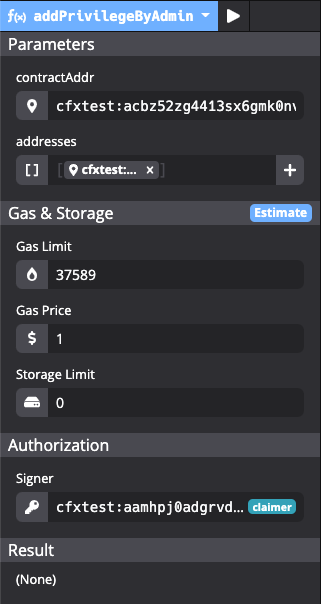
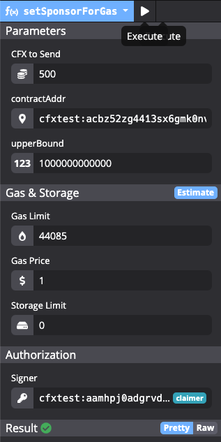
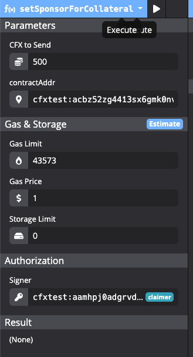

# Conflux 中的代付及讨论

## 代付简介

绝大部分的公有链中都存在着名为 ***gas*** 的机制（或称之为“燃气费”），该机制有着丰富的作用，如对抗拒绝服务攻击、回避智能合约的停机问题、激励矿工等。但 gas 机制也随之带来了一个问题，那就是提高了用户与智能合约进行交互的门槛 —— gas 意味着拥有区块链中的原生代币是与智能合约进行交互的**前提**。

就原生代币的获取途径而言，除了挖矿外，用户只能通过链下的方式从其他用户处（也包括交易所）获取。在当前的大环境下，不管是挖矿还是链下交易，都意味着极高的门槛。此外，用户每次与合约进行交互都意味着花费 gas，每次操作都存在着成本，用户在交易之前可能权衡付出这么多 gas 是否值得.这一点在以太坊上体现得非常明显，直接在主链操作需要付出高额的 gas（不过高 gas 费的问题可以通过部分 layer2 的技术缓解）。

Conflux 中的代付机制，简而言之，就是允许其他用户为某个智能合约的交互者支付 gas 费（在 Conflux 中*存储抵押费*也可被代付，这里先不谈）。“被代付”的用户发起交易时不必承担 gas 开销。代付启用后，一个余额为0的账户也能够与合约进行交互，极大地降低了用户与合约交互的门槛。

## 设置代付

正如“代付”这个名字所表达的，一个余额为0的账户能够与合约进行交互，并不是因为相应的费用被免除了，而是有其他人支付了相应的费用。 Conflux 的内置合约 `SponsorWhitelistControl` 就负责管理代付机制。提供代付资金的人向`SponsorWhitelistControl`支付一笔CFX，并指定代付的合约地址即可。

如果不想考虑任何代付的细节，只是希望为一个还没有设置代付的合约设置代付的话，可以按照下面的步骤进行交互。这里会略去繁琐的细节，并且尽可能地保证此设置能对几乎所有的合约通用。下面的截图中使用了 `Conflux Studio` 的图形化界面与`SponsorWhitelistControl`合约进行交互（`Conflux Studio`的使用方法可以参考 https://zhuanlan.zhihu.com/p/202741940）。
<!-- 文章最后也会提供对应的使用 `js-conflux-sdk` 的 javascript 脚本。 -->

1. 合约的admin（或合约本身）在`SponsorWhitelistControl`中设置代付白名单列表。合约的 admin 默认为**合约的创建者**，关于 admin 更详细的说明可以参考 [Conflux 内置合约功能介绍](https://juejin.cn/post/6876330619798814728)中`AdminControl`的部分。
   1. 与`SponsorWhitelistControl`合约（地址`0x0888000000000000000000000000000000000001`）交互。选择`addPrivilegeByAdmin`方法。
   2. 在参数中`contractAddr`设置为希望设置代付的合约地址。
   3. `addresses`参数中添加元素`cfxtest:aaaaaaaaaaaaaaaaaaaaaaaaaaaaaaaaaa6f0vrcsw`（cfxtestnet中 的 0 地址）。
   4. `signer` 选择合约的admin。
   5. 在Estimate后执行，不出错即可。
    
2. 设置 Gas 代付。
   1. 仍然与`SponsorWhitelistControl`合约交互。选择`setSponsorForGas`方法。
   2. 设置`CFX to Send`。填入`500`。
   3. `contractAddr`设置为希望设置代付的合约地址。
   4. `upperBound`设置为`10000000000`（10G）
   5. `signer`可以进行任意设置，只要其具有足够多的 CFX 即可（大于设置的500）
   6. 同前estimate并执行
   
3. 设置抵押代付。
   1. 与`SponsorWhitelistControl`合约交互。选择`setSponsorForCollateral`方法。
   2. 设置`CFX to Send`。填入500。
   3. `contractAddr`设置为希望设置代付的合约地址。
   4. `signer`可以进行任意设置，只要其具有足够多的 CFX 即可（大于设置的500）
   5. 同前estimate并执行
   

至此，合约的代付设置完毕。在测试网环境中，CFX 代币可以通过测试网水龙头获取（Conflux Portal，Conflux Studio 中均有入口，也可以使用[测试网水龙头DApp](http://faucet.confluxnetwork.org/)进行获取）。在主网（Conflux Tethys中）可以在Conflux Scan的[赞助合约页面](https://confluxscan.io/sponsor)页面向Conflux基金会申请，由Conflux基金会为合约代付。
   

## 代付中的部分细节说明

本部分会对上述提到的部分参数进行说明，详细的说明可以参考[Conflux 内置合约功能介绍](https://juejin.cn/post/6876330619798814728)，该文对代付的方方面面做到了非常详尽的介绍。

### 合约的代付白名单列表

合约代付采用了白名单机制，在`SponsorWhitelistControl`合约中，为每个地址维护了一个白名单列表，只有位于白名单中的用户才能被代付。默认情况下该白名单为空，意味着代付未被启用。

该列表由合约的 admin 调用`addPrivilegeByAdmin`进行设置，或者由合约自己调用`SponsorWhitelistControl`合约的addPrivilege方法。如果白名单中存在0地址，那么任何与合约交互的用户都可以被代付。同时该合约也能够调用对应的接口（remove）移除白名单内的用户。

通常情况下，为该名单添加0地址即可满足我们的要求。

### Gas代付设置中的upperBound

在 Gas 代付设置`setSponsorForGas`中除了需要设置发送的 CFX 数目与合约地址外，还需要设置参数 upperBound。该参数意味着每笔被代付交易能够消耗的Gas上限（单位为Drip，即10e-18 CFX），即该参数意味着被代付的交易需要满足`upperBound ≤ gasUsed * gasPrice`。如果交易所需的gas超过了upperBound, gas 费将不会被代付，而是由发起交易的用户本人进行支付。Conflux 的 tps 非常高，一般而言交易的 gasPrice 设为 1 即可满足需求。Conflux基金会在进行代付时会将该值设置为10G，这可以涵盖基本所有交易。

此外需要说明的是参数 upperBound 与参数 CFX to send 中间存在着约束关系，后者需要不小于前者的1000倍。注意到二者单位不一致，仅比较数字的话意味着`upperBound ≤ CFX_to_send * 10**15`。

### 存储抵押的代付

在 Conflux 中，当用户在智能合约中每存储 1 KB 的数据，他就需要抵押 1 CFX 作为押金。押金并没有被消耗，在满足一定条件时会被退还。矿工也会因为存储了数据而获得补偿。对于存储抵押的详细介绍可以参考[Conflux 研究院 | 存储押金机制](https://juejin.cn/post/6879964961854980104)：
> 在存储空间的使用期间，押金会产生年化 4.08% 的利息，这些利息将直接分配给矿工，用于补偿矿工们的存储成本在存储空间的使用期间，押金会产生年化 4.08% 的利息，这些利息将直接分配给矿工，用于补偿矿工们的存储成本。存储押金的价格锁定为 1 CFX/KB。例如，如果当前共有 100 GB 的数据需要存储，那么存储押金总量大约是一亿 CFX，平均每个区块产生的利息约为 0.06 CFX

### 代付余额的查询

设置代付后，CFX 将从代付者转移至`SponsorWhitelistControl`合约。当代付发生时，`SponsorWhitelistControl`中对应的余额会被消耗(存储对应的则是被抵押)，可以通过`SponsorWhitelistControl`的`getSponsoredBalanceForCollateral`和`getSponsoredBalanceForGas`查询。

## 代付设计的讨论

### DDoS 攻击

天然地，代付机制的目的就和 gas 机制本身存在着矛盾 —— gas 的存在提高了进行交易的门槛，但这也是对恶意的攻击者的门槛。这个门槛消失的时候，也为攻击者打开了方便之门。例如攻击者可以利用具有代付的合约，构造并发起大量的交易拥塞网络。

这也许也是白名单机制存在的理由。初了解到代付机制时，很容易会疑惑：既然代付一个主要的目的是为了降低使用的门槛，那么为什么还需要白名单机制，对代付加以限制？从这个角度看，可能是作为潜在的保险，可以通过设置白名单仅为合乎条件的用户启用代付，防止代付被滥用。

### 恶意消耗代付

另一方面，代付也可能被恶意地消耗，直观来说，恶意的攻击者可以通过为普通交易设置极高的 gasPrice，这样通过简单地构造少量的交易就能快速地消耗sponsoredGas。矿工能够从这种攻击中直接获利。当大夫被耗尽时，被消耗代付的合约需要重新设置代付，期间可能会影响用户的正常使用。这可能也是upperBound这个参数的意义之一——通过设置合适的upperBound可以减缓sponsoredGas被消耗的速度。Conflux 基金会设置的 10G upperBound 看起来很高，但只相当于 `10**-8 CFX`，足以支持非常多的交易。

但是相对的，存储抵押的代付可以被更容易地被占用，相比 gas 的消费，抵押占用的费用要高得多。每占用 1 KB的存储空间，对应的就会有 1 CFX 被锁定。如果真的存在攻击者有意地实施攻击，存储抵押的代付可能很容易被消耗殆尽。矿工是否可以通过这种方式获利可能需要比较仔细的讨论（矿工可以获取存储抵押的利息，但也付出了存储空间；每个矿工付出了相同的存储空间，但获利并不一致）。不过由于攻击者付出的代价非常小，这种攻击仍有可能会发生。

> 恶意消耗存储的例子：例如ERC20合约，用户随机地将10-18 ERC20 代币发送给随机的地址就能够很容易地消耗存储

### 潜在的缺陷与收益

就上面的讨论与整体环境而言，Conflux 在代付上做出的限制还是一种“防君子不防小人”的态度。但是退一步来说，就算相应的攻击发生了，危害也并没有想象中的那么大 —— 或者说问题的源头也并不是代付本身。就 DDoS 攻击而言，攻击者如果希望实施 DDoS 攻击，以目前 Conflux 网络的费率标准而言，不使用代付时花费的成本也非常低，使用代付与否没有很大区别。而就恶意消耗代付而言，合约中gas与抵押存储也仅仅是“回归正常”，即没有代付的模式，也并不比没有代付的情况更差。

但相应的，有了代付后，与合约交互的门槛大幅降低，这对于刚起步的项目（某种意义也包括 Conflux 本身）的帮助无疑是极大的。相比代付带来的收益，代付中存在的潜在缺陷在目前阶段可能并不关键了。

## 参考文章

[Conflux 内置合约功能介绍](https://juejin.cn/post/6876330619798814728)：Conflux 官方对 Conflux 的内置合约进行的介绍，信息很详尽。
[Conflux Studio 使用介绍](https://zhuanlan.zhihu.com/p/202741940): Conflux Studio 的操作方法介绍。值得一提的是现在也有web版可以使用 https://conflux.ide.black/（可能加载会比较慢）
[新项目如何高效启动？Conflux 代付机制了解一下](https://juejin.cn/post/6904212662629236749): Conflux 官方对代付机制的介绍。
[Conflux 研究院 | 存储押金机制](https://juejin.cn/post/6879964961854980104)：关于存储抵押的介绍
