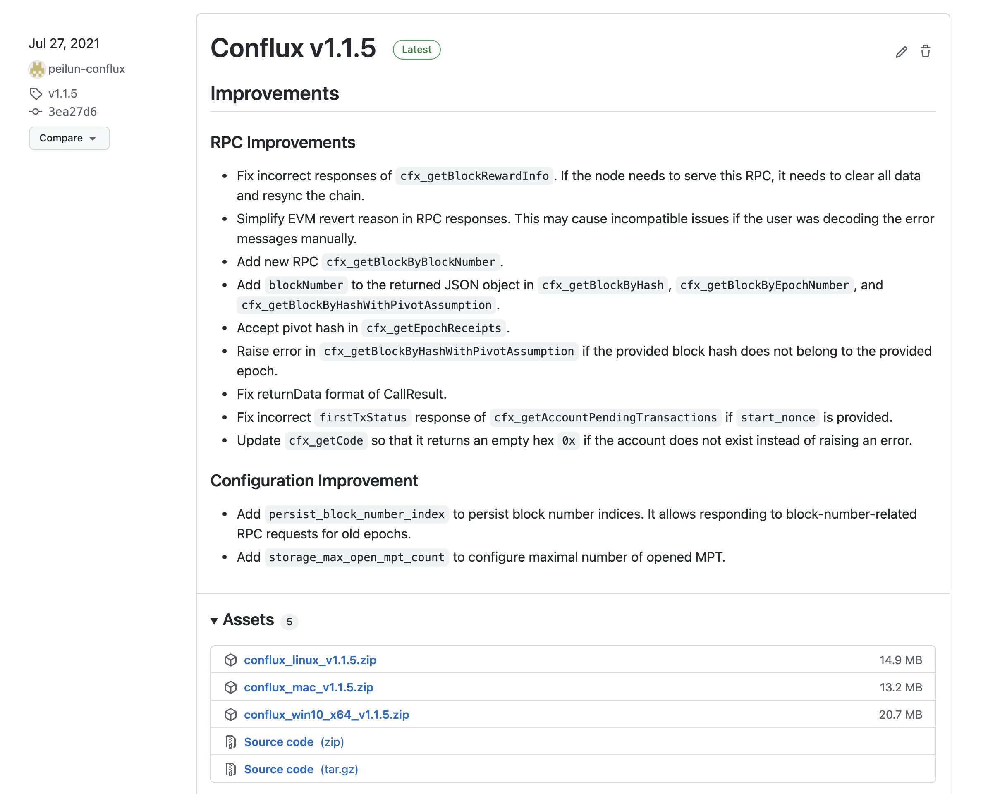

# 如何运行一个 Conflux 节点

Conflux 是一个基于 PoW(工作量证明) 的完全去中心化网络，如果想要参与此去中心化网络挖矿，或者拥有自己的 RPC 服务需要自己运行一个 node (也称 client)。本文将介绍如何运行一个 Conflux 节点。

## Archivenode VS fullnode

Conflux 的节点分为三种类型：归档节点(archivenode)，全节点(fullnode)，轻节点(lightnode)。不同类型节点的区别在于保留存储的数据量不同，归档节点最全，轻节点最少。当然存储数据越多消耗的系统硬件资源越多。关于不同类型节点的详细介绍[参看这里](https://juejin.cn/post/6854573216930693134)

通常情况下如果想参与挖矿,运行一个全节点即可，如果想作为 RPC 服务来使用则需要运行一个 Archivenode. 轻节点则主要用于作为钱包来使用。

## 机器配置

运行一个 archivenode 的机器资源大致如下：

* CPU：`4Core`
* 内存：`16G`
* 硬盘：`200G`

fullnode 对机器配置的要求会低一些，如果想参与挖矿出块的话，需要有单独的`显卡`。

另外: 建议将系统的最大文件打开数调高到 `10000`。一般 Linux 系统默认为 1024, 不太够用。

## 如何获取节点程序和配置

Conflux 网络节点程序的获取方式，首推到官方 Github [Conflux-rust](https://github.com/conflux-chain/conflux-rust) 仓库的 [Release](https://github.com/Conflux-Chain/conflux-rust/releases) 页面进行下载, 一般直接下载最新 Release 的版本即可。每个 Release 的版本不仅包含源代码，还提供 Windows, Mac, Linux 三大平台预编译好的节点程序。



**需要注意**的是目前主网和测试网节点程序的版本发布是两条线: 主网一般是 `Conflux-vx.x.x`, 测试网则为 `Conflux-vx.x.x-testnet`. 下载程序时需要根据个人的需求选择正确的版本线。

下载的 zip 包，解压后是一个 run 文件夹，里面包含如下内容：

```sh
➜  run tree
.
├── conflux  # 节点程序
├── log.yaml # 日志配置文件
├── start.bat # windows 启动脚本
├── start.sh # unix 启动脚本
├── tethys.toml # 主网配置文件
└── throttling.toml # 限流配置文件

0 directories, 6 files
```

其中主要文件为 `conflux` 和 `tethys.toml`, 如果下载的是 windows 包的话, 节点程序为 `conflux.exe`

另外一种方式是从源码编译节点程序，如果有兴趣的话，可以[参考此文档](https://developer.confluxnetwork.org/conflux-doc/docs/installation)自行编译。

## 主要配置项

在运行节点前需要先准备好节点配置文件，在下载的程序包里可以找到配置文件，一般主网是 `tethys.toml`, 测试网则为 `testnet.toml`. 两个配置文件主要区别在于 `bootnodes` 和 `chainId` 的配置值不同。开发者也可以到 `conflux-rust` Github 仓库的 `run 目录`下面查找配置文件。文件名同样为 [`tethys.toml`](https://github.com/Conflux-Chain/conflux-rust/blob/master/run/tethys.toml) 或 `testnet.toml`。

**通常情况用户不需要修改任何配置，直接运行启动脚本即可**(不想了解配置细节？直接跳到下一章节运行节点)。但如果想打开某些功能或自定义节点某些行为，就需要自行设置一些配置参数，以下为最常用的一些配置：

### 节点类型

* `node_type`: 用于设置启动节点的类型，可选值为 `full` (默认值), `archive`, `light` 

### chainId

* chainId 用于配置节点要连接的链的ID，主网为 1029, 测试网为 1 (一般不需要修改)

### Miner related

* `mining_address`: 节点挖矿奖励接收地址，可以配置 hex40 地址或 CIP-37 地址(注意：地址的 network prefix 需要与当前配置的 chainId 一致)，如果配置了该项 `minint_type` 默认为 `stratum`
* `mining_type`: 可选值为 `stratum`, `cpu`, `disable`
* `stratum_listen_address`: stratum 地址
* `stratum_port`: stratum 端口号
* `stratum_secret`: stratum 连接凭证

### RPC related

* `jsonrpc_cors`: 用于控制 rpc 域名验证策略，可选值为 `none`, `all`, 或者逗号(无空格)分隔的域名
* `jsonrpc_http_keep_alive`: `false` or `true` 用于控制是否为 rpc HTTP connections 设置 KeepAlive 
* `jsonrpc_ws_port`: websocket rpc 端口号
* `jsonrpc_http_port`: http rpc 端口号
* `public_rpc_apis`: 对外开放访问的 rpc api，可选值为 `all`, `safe`, `cfx`, `debug`, `pubsub`, `test`, `trace` (safe=cfx+pubsub)。一般建议设置为 `safe`
* `persist_tx_index`: `true` or `false` 如果需要处理 transaction 相关 RPCs 的话，需要同时打开此配置，不然将只能访问到最近的交易信息
* `persist_block_number_index`: `true` or `false` 如果想要通过 blockNumber 查询 block 信息，需要打开此配置
* `executive_trace`: `true` or `false` 是否打开 trace EVM execution 功能，如果打开 trace 会被记录到 database 中
* `get_logs_filter_max_epoch_range`: Event log 获取方法 `cfx_getLogs` 调用，对节点性能影响很大，可以通过此选项配置 该方法一次能查询的 epoch 范围最大值
* `get_logs_filter_max_limit`: `cfx_getLogs` 方法一次查询能够返回 log 数量的最大值

### Snapshot 

* `additional_maintained_snapshot_count`: 用于设置 stable checkpoint 之前 snapshot 需要保留的个数，默认为 0， stable genesis 之前的 snapshot 都会被删掉。如果用户想查询比较久远的历史状态，需要设置此选项。此选项开始后，磁盘用量同样会增加许多。

### directries

* `conflux_data_dir`: 数据（block data, state data, node database）的存放目录
* `block_db_dir`: block 数据存放目录，默认情况会存放到 conflux_data_dir 指定目录下的 blockchain_db 目录中
* `netconf_dir`: 用于控制 network 相关的持久化目录，包括 `net_key`

### Log related

* `log_conf`: 用于指定 log 详细配置文件如 `log.yaml`，配置文件中的设置会覆盖 `log_level` 设置
* `log_file`: 指定 log 的路径，不设置的话会输出到 stdout
* `log_level`: 日志打印的级别，可选值为 `error`, `warn`, `info`, `debug`, `trace`, `off` 

日志的 log 级别越高，打印的日志越多，响应的会占用贡多的存储空间，也会影响节点的性能.

### 开发者(dev)模式

智能合约开发者，在合约开发前期希望在本地的节点环境中部署和测试自己的代码，可使用此模式：

* 注释掉 `bootnodes` 配置
* `mode`: 将节点模式配置为 `dev`
* `dev_block_interval_ms`: 出块间隔时间, 单位为毫秒(ms) 

此模式下会运行一个单节点网络，并打开所有的 RPC 方法。

### 配置 genesis 账户

在 dev 模式下可以通过一个单独的 `genesis_secrets.txt` 文件，配置 genesis 账户，该文件中需要一行放置一个私钥（不带0x前缀）, 并在配置文件中添加 `genesis_secrets` 配置项，将值配置为 该文件的路径:

```toml
genesis_secrets = './genesis_secrets.txt'
```

这样节点启动之后，每个账户初始会有 `10000,000,000,000,000,000,000` Drip 也就是 1w CFX。

### 其他

* `net_key`: 是一个 256 bit 的私钥，用于生成唯一 node id，该选项如果不调会随机生成，如果设置可以填一个长度为 64 的 hex 字符串
* `tx_pool_size`: 交易允许存放的最大交易数(`默认 50W`)
* `tx_pool_min_tx_gas_price`: 交易池对交易 gasPrice 的最小限制(`默认为 1`)

关于完整的配置项，可以直接查看配置文件，其中有所有的可配置项，以及详细的注释介绍.

## 运行节点

配置文件配好了，就可以通过节点程序，运行节点了。
```sh
# 运行启动脚本
$ ./start.sh
```

如果你在 stdout 或日志文件看到如下内容，表示节点已经成功启动了:

```
2021-04-14T11:54:23.518634+08:00 INFO  main                 network::thr - throttling.initialize: min = 10M, max = 64M, cap = 256M
2021-04-14T11:54:23.519229+08:00 INFO  main                 conflux      -
:'######:::'#######::'##::: ##:'########:'##:::::::'##::::'##:'##::::'##:
'##... ##:'##.... ##: ###:: ##: ##.....:: ##::::::: ##:::: ##:. ##::'##::
 ##:::..:: ##:::: ##: ####: ##: ##::::::: ##::::::: ##:::: ##::. ##'##:::
 ##::::::: ##:::: ##: ## ## ##: ######::: ##::::::: ##:::: ##:::. ###::::
 ##::::::: ##:::: ##: ##. ####: ##...:::: ##::::::: ##:::: ##::: ## ##:::
 ##::: ##: ##:::: ##: ##:. ###: ##::::::: ##::::::: ##:::: ##:: ##:. ##::
. ######::. #######:: ##::. ##: ##::::::: ########:. #######:: ##:::. ##:
:......::::.......:::..::::..::..::::::::........:::.......:::..:::::..::
Current Version: 1.1.3-testnet

2021-04-14T11:54:23.519271+08:00 INFO  main                 conflux      - Starting full client...
```

节点启动后会在 run 目录里新建两个文件夹 `blockchain_data`, `log` 用于存储节点数据和日志。

启动一个全新的主网或测试网节点后，它会从网络同步历史区块数据，追赶中的节点处于 catch up 模式，可以从日志看到节点的状态和最新的 epoch 数：
```
2021-04-16T14:49:11.896942+08:00 INFO  IO Worker #1         cfxcore::syn - Catch-up mode: true, latest epoch: 102120 missing_bodies: 0
2021-04-16T14:49:12.909607+08:00 INFO  IO Worker #3         cfxcore::syn - Catch-up mode: true, latest epoch: 102120 missing_bodies: 0
2021-04-16T14:49:13.922918+08:00 INFO  IO Worker #1         cfxcore::syn - Catch-up mode: true, latest epoch: 102120 missing_bodies: 0
2021-04-16T14:49:14.828910+08:00 INFO  IO Worker #1         cfxcore::syn - Catch-up mode: true, latest epoch: 102180 missing_bodies: 0
```

你也可以通过 `cfx_getStatus` 方法获取当前节点的最新 epochNumber，并跟 scan 的最新 epoch 比较从而判断数据是否已经同步到了最新。

### RPC 服务

节点启动之后，并且打开了 RPC 相关的端口号和配置的话，则钱包，Dapp 可以通过 RPC url 访问节点. 例如

```http://node-ip:12537``` 

Portal 钱包中添加网络，或者 SDK 实例的时候可以使用此地址.

## 使用 Docker 运行节点

对 Docker 比较熟悉的小伙伴也可以使用 Docker 来运行一个节点。官方提供了各个版本的 [Docker image](https://github.com/conflux-chain/conflux-docker) 可以自行 pull image 并运行。

因为节点数据比较大，所以建议在运行 image 时，挂载一个数据目录用于存放节点数据。

目前发布的镜像 tag 有三条 pipline:

* `x.x.x-mainnet`: 主网镜像
* `x.x.x-testnet`: 测试网镜像
* `x.x.x`: 开发模式镜像，此模式下会自动初始化十个账号，可用于本地快速开发

## 常见问题

### 为什么重启后，同步需要很久？

节点重启后会从上个 checkpoint 开始同步，并重新 replay 区块数据，根据当前距离上一 checkpoint 的远近，需要等待不同的时长，才能开始从最新区块开始同步.
这是正常现象，一般会等几分钟到十几分钟不等。

### 为什么节点同步区块高度卡主，不再增长?

区块通过卡主，可查看日志或终端是否有错误，如果没有错误大概率是因为网络原因，可尝试重启节点。

### 修改配置后，重启节点需要清楚数据么?

分情况，有的需要，有的不需要。如果配置涉及到数据存储或数据索引，配置若发生变化，需要重启节点，比如:

* `persist_tx_index`
* `executive_trace`
* `persist_block_number_index`

其他配置则一般不需要.

### 目前的 archive node 数据有多大?

截止到 2021.11.04 区块数据的压缩包大小为不到 90 G

### 如何参与挖矿?

挖矿需要使用 GPU 参与，具体可参看[这里](https://forum.conflux.fun/t/conflux-tethys-gpu-mining-instruction-v1-1-4/3775)

### 如何快速同步数据，从而运行一个 archive node 

可使用 [fullnode-node](https://github.com/conflux-fans/fullnode-tool) 下载归档节点的数据快照，使用快照的节点数据，可以快速同步到最新数据。

### 节点运行 error 日志怎么看?

如果是通过 `start.sh` 运行的节点，可以在相同目录中的 `stderr.txt` 查看错误原因。

### 如何运行一个 PoS 节点?

TO BE UPDATE

## 参考

* [官方运行节点文档](https://developer.confluxnetwork.org/run-a-node/en/how_to_get)
* [节点程序源码](https://github.com/conflux-chain/conflux-rust)
