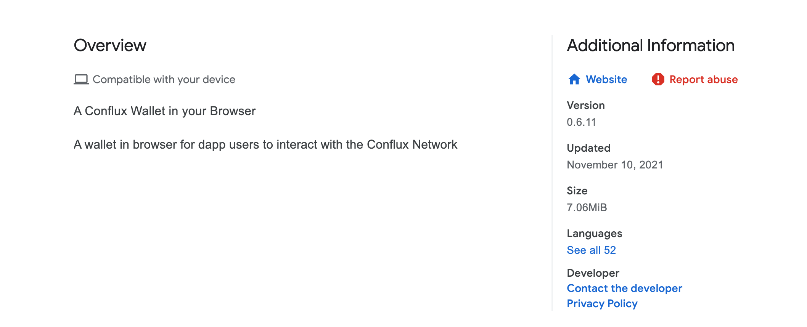
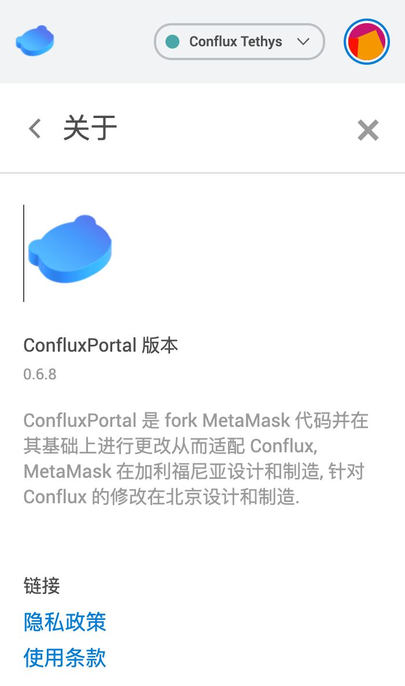
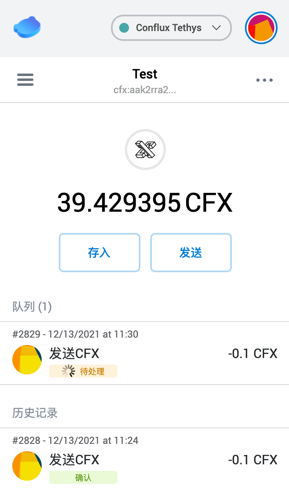
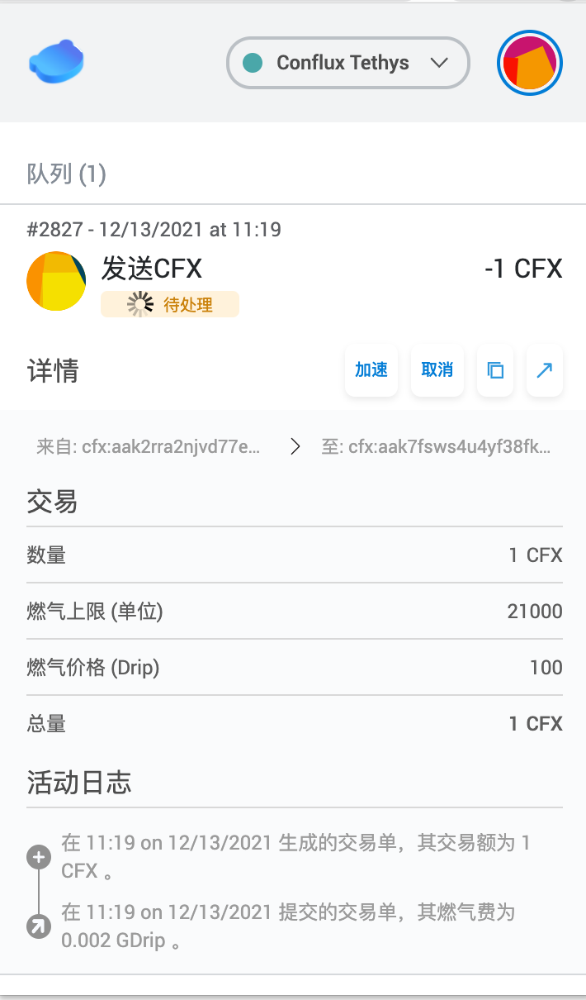
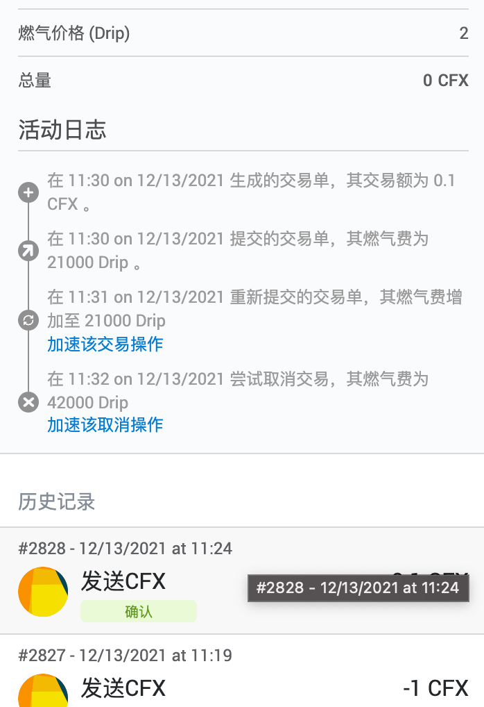
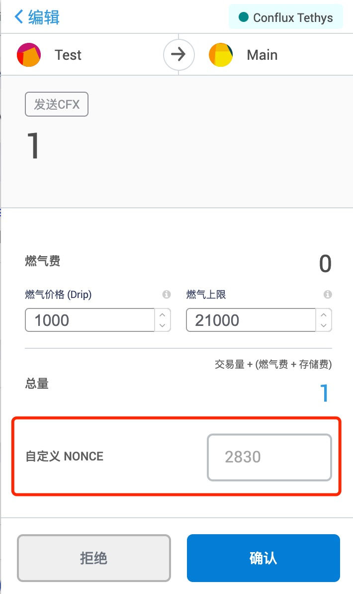

# Portal 如何加速交易

## 版本问题

[ConfluxPortal](https://chrome.google.com/webstore/detail/confluxportal/bjiiiblnpkonoiegdlifcciokocjbhkd?utm_source=chrome-ntp-icon) 当前(2021-12-13号)的最新的版本是 0.6.11 , 该版本优化了交易 gasPrice 设置逻辑，默认改为了 `30000`, 此优化主要为解决 Conflux 网络拥堵时，交易执行慢的问题。

版本 `0.6.8 以上`的 Portal 会自动升级到最新版插件，0.6.8 及以下因为发行账户更换的问题已无法自动升级，需要用户手动下载新版钱包插件才能进行升级。

**注意：升级钱包前一定要确保备份了助记词, 如果没有备份需要先导出私钥或将资产转移到其他钱包**

## 交易发送失败

在 Conflux 网络比较拥堵的时候，发送的交易如果设置的 `gasPrice` 较低 (0.6.8 版 portal 默认 gasPrice 为 1), 可能交易会直接失败，此种情况大概率是遇到了 `txpool is full` 错误。此时可以尝试重发交易并把交易的 `gasPrice` 提高到 `30000` 以上。如果仍然失败可以继续提高 gasPrice （每次提高 1w） 重发尝试两三次，一般可以解决。

## 交易加速

正常情况下，交易被发出后`最多十几秒`交易可被执行。但如果 gasPrice 设置过低或网络比较拥堵，交易可能会一直 pending 不被打包。

### 交易加速

这时可以根据 [why-tx-is-pending](./why-tx-is-pending.md) 这篇文章确认交易 pending 的原因。如果交易的 pending 原因是 Ready to pack (nonce 和 余额均没有问题) 则可以尝试通过提高 gasPrice 来加速交易。Portal 对于 pending 的交易提供了`加速`或`取消` 的功能。
点击加速可以提高交易的 `gasPrice`，这时需要`手动`将 gasPrice `提高 10000`。

### 再次加速

如果交易仍然一直处于 pending 状态，可再次尝试`加速该交易|取消操作`提高 gasPrice 并重新发送。

### 手动设置 nonce 和 gasPrice 加速

另外也可以在设置中打开`允许手动设置交易 nonce` 的高级功能，然后新发送一笔交易，并把交易的 nonce 设置为一致处于 pending 状态交易的 nonce，并提高 gasPrice 点击发送即可.

