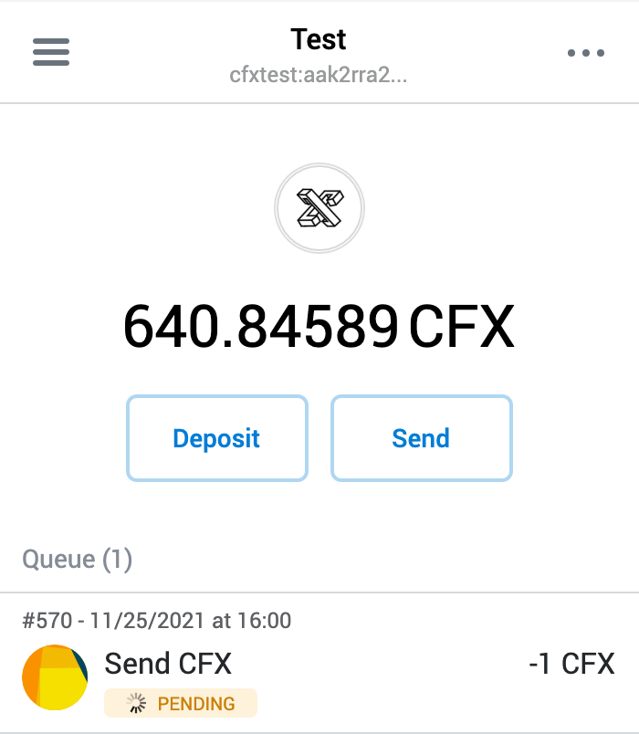
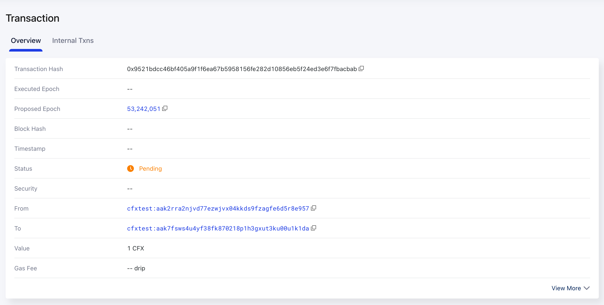
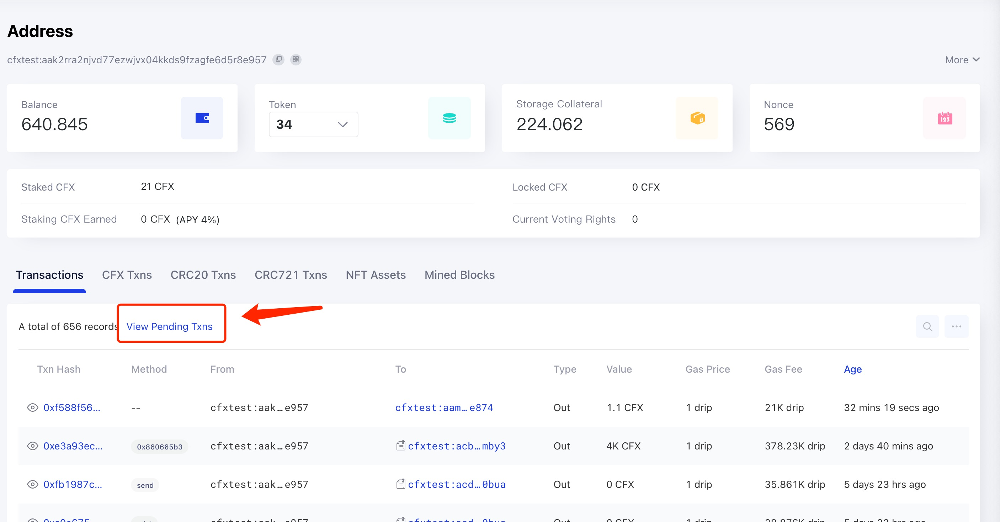

# 为什么交易一直不打包?

因为当前区块链存在低吞吐率，高使用门槛等问题，通过区块链发送交易的时候难免会遇到交易迟迟不被打包的问题。以 Conflux 为例，
Conflux 网络正常情况一秒钟出两个块，一笔交易被`成功发出`之后应该在`几秒到十几秒内`，会被打包并执行。
如果交易迟迟不被打包，那大概率是什么地方出了问题，需要发送者进行手动干预.

## 如何确定交易 pending 的原因

Pending 的交易, 如果被成功传播到 Scan 所使用节点的交易池内，那么可以在 Scan 上通过 hash 搜索到该交易，在交易详情页可以看到交易的状态为 `Pending`

这时我们可以进入到交易发送方的`账户详情页`，通过账户的 Pending 交易列表 Tab，查看该用户目前 pending 的交易

在该 tab 可以看到当前用户 pending 交易的`总数`，以及最早 pending 的交易（最多10条）。最为关键的是还可以看到第一条 pending 交易的 pending 原因，可能的原因有三种:

* Wrong nonce
* Insufficient balance
* Ready to pack

该页面其实是通过 RPC 方法 [`cfx_getAccountPendingTransactions`](http://developer.confluxnetwork.org/conflux-doc/docs/json_rpc/#cfx_getaccountpendingtransactions) 获取的某账户当前 pending 的交易信息的

### Wrong nonce

此种错误表示发送的交易使用了错误的 nonce，正常情况交易需要按照 nonce 顺序 one by one 执行。如果某笔交易的 nonce 之前有一个或多个 nonce 的交易未执行，则此交易会一直等待，知道之前所有的交易成功执行。

这种情况我们需要使用正确的 nonce 重新发送交易。需要注意的是 pending 的交易在其前边所有交易都执行后(并且余额足够)，会自动执行。

### Insufficient balance

在 Conflux 网络，如果交易的发送方余额不足以支付某笔交易的金额+手续费，交易也可以被成功发送到交易池，但会处于 pending 的状态，不被打包执行。
此种情况只需要向该账户转足够的 CFX 即可。

### Ready to pack

此种情况比较特殊，表示交易本身已经达到了可以被打包的条件，但是因为整个网络比较拥堵或其他原因，还未被打包。

如果交易长时间处于此种状态，可以适当提高交易的 gasPrice 重新发送交易，这样可以提高交易的打包执行速度。

## 如何正确的设置 gasPrice

可以使用 fullnode 的 `cfx_gasPrice` RPC 方法获取一个建议的 gasPrice 值。该方法会根据一定数量最新的区块的 gas 使用情况及其中的交易的 gasPrice 来给出一个推荐值。

最理想的方式是根据网络节点交易池中交易的  gasPrice 设置情况来计算一个合适的 gasPrice，但当前缺少相关的 RPC 方法支持。